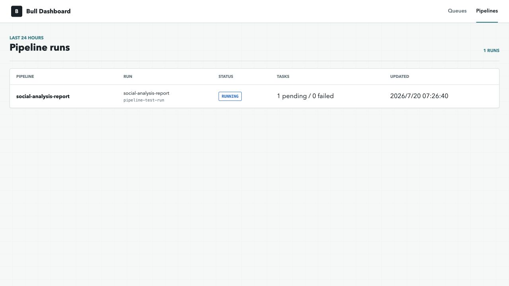
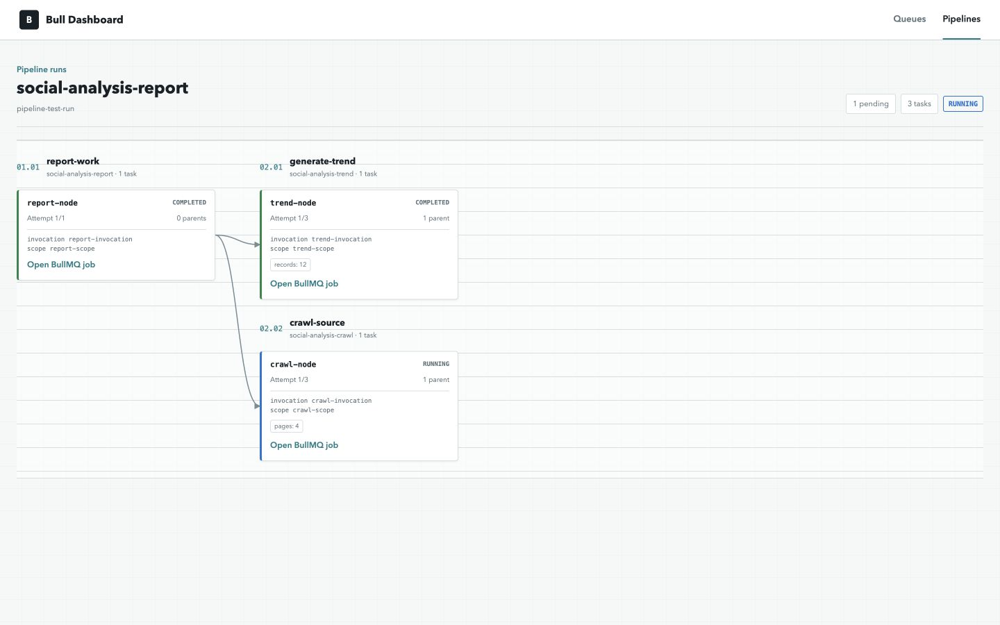

Docker image for [bull-board]. Allow you to monitor your bull queue without any coding!

Supports both: bull and bullmq. bull-board version v3.2.6

### Quick start with Docker

```
docker run -p 3000:3000 deadly0/bull-board
```

will run bull-board interface on `localhost:3000` and connect to your redis instance on `localhost:6379` without password.

To configurate redis see "Environment variables" section.

### Quick start with docker-compose

```yaml
version: '3.5'

services:
  bullboard:
    container_name: bullboard
    image: deadly0/bull-board
    restart: always
    ports:
      - 3000:3000
```

will run bull-board interface on `localhost:3000` and connect to your redis instance on `localhost:6379` without password.

see "Example with docker-compose" section for example with env parameters

### Pietra Pipeline Dashboard

The image also provides a read-only dashboard for distributed Pietra Pipeline runs. Open `/pipelines`, or use the `Pipelines` link in Bull Board. The page uses the same Redis connection, login protection, and `PROXY_PATH` as the queue dashboard.



The run page groups nodes by graph depth, Pipeline, and step. It shows parent-child edges, status, attempts, progress, Invocation and Scope IDs, and links each node back to its BullMQ job.



The dashboard reads these Pipeline snapshots without changing them:

```text
pietra:pipeline:runs
pietra:pipeline:run:{runId}
pietra:pipeline:run:{runId}:nodes
pietra:pipeline:run:{runId}:node:{nodeId}
```

JSON endpoints are available at `/api/pipelines` and `/api/pipelines/{runId}`. Finished snapshots follow the Pipeline runtime's 24-hour retention; active runs remain visible until they settle.

### Environment variables

- `REDIS_HOST` - host to connect to redis (localhost by default)
- `REDIS_PORT` - redis port (6379 by default)
- `REDIS_DB` - redis db to use ('0' by default)
- `REDIS_USE_TLS` - enable TLS true or false (false by default)
- `REDIS_PASSWORD` - password to connect to redis (no password by default)
- `BULL_PREFIX` - prefix to your bull queue name (bull by default)
- `BULL_VERSION` - version of bull lib to use 'BULLMQ' or 'BULL' ('BULLMQ' by default)
- `PROXY_PATH` - proxyPath for bull board, e.g. https://<server_name>/my-base-path/queues [docs] ('' by default)
- `USER_LOGIN` - login to restrict access to bull-board interface (disabled by default)
- `USER_PASSWORD` - password to restrict access to bull-board interface (disabled by default)
- `METRICS_ENABLED` - enable Prometheus metrics endpoint (disabled by default)
- `METRICS_VAR_*` - custom labels for Prometheus metrics (e.g., `METRICS_VAR_env=production`, `METRICS_VAR_server=1`)

### Restrict access with login and password

To restrict access to bull-board use `USER_LOGIN` and `USER_PASSWORD` env vars.
Only when both `USER_LOGIN` and `USER_PASSWORD` specified, access will be restricted with login/password

### Prometheus Metrics

Enable Prometheus metrics endpoint with `METRICS_ENABLED=true`. This requires BullMQ queues (not supported for Bull v3).

**Endpoints:**
- `GET /metrics` - Prometheus metrics for all queues
- `GET /metrics/{queueName}` - Prometheus metrics for a specific queue

**Authentication:**
When `USER_LOGIN` and `USER_PASSWORD` are set, metrics endpoints require HTTP Basic Authentication:
```bash
curl -u username:password http://localhost:3000/metrics
```

**Custom Labels:**
Add custom labels to metrics using `METRICS_VAR_*` environment variables:
```
METRICS_VAR_env=production
METRICS_VAR_server=1
METRICS_VAR_region=us-east-1
```

These will be included in the metrics output:
```
bullmq_job_count{queue="my-queue", state="waiting", env="production", server="1", region="us-east-1"} 5
```

**Prometheus Configuration Example:**
```yaml
scrape_configs:
  - job_name: 'bull-board'
    basic_auth:
      username: 'your-username'
      password: 'your-password'
    static_configs:
      - targets: ['localhost:3000']
    metrics_path: '/metrics'
```

### Example with docker-compose

```yaml
version: '3.5'

services:
  redis:
    container_name: redis
    image: redis:5.0-alpine
    restart: always
    ports:
      - 6379:6379
    volumes:
      - redis_db_data:/data

  bullboard:
    container_name: bullboard
    image: deadly0/bull-board
    restart: always
    ports:
      - 3000:3000
    environment:
      REDIS_HOST: redis
      REDIS_PORT: 6379
      REDIS_PASSWORD: example-password
      REDIS_USE_TLS: 'false'
      BULL_PREFIX: bull
      METRICS_ENABLED: 'true'
      METRICS_VAR_env: production
      METRICS_VAR_server: '1'
    depends_on:
      - redis

volumes:
  redis_db_data:
    external: false
```

[bull-board]: https://github.com/vcapretz/bull-board
[bull-board]: https://github.com/felixmosh/bull-board#hosting-router-on-a-sub-path
